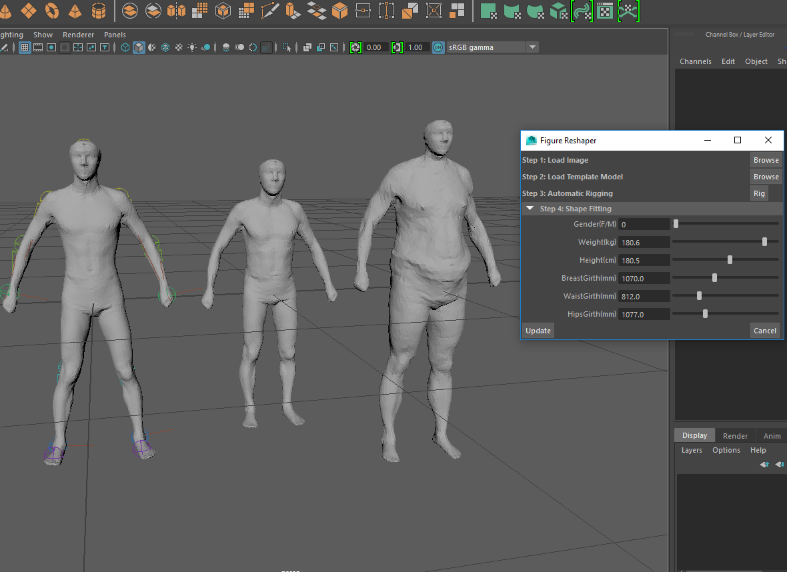

# FigureReshaper - A Maya Plugin

__By Xueyin Wan, Liang Peng__

CIS 660 Advanced Topics in Computer Graphics and Animation

Instructor: Stephen Lane

University of Pennsylvania

# Papar
* Shizhe Zhou, Hongbo Fu, Ligang Liu, Daniel Cohen-Or, Xiaoguang Ha. Parametric Reshaping of Human Bodies in Images. ACM Transactions on Graphics, Vol. 29, No. 4, Article 126, Publication date: July 2010.
* N. Hasler, C. Stoll, M. Sunkel, B. Rosenhahn, and H.-P. Seidel. A Statistical Model of Human Pose and Body Shape. EUROGRAPHICS 2009 / P. Dutré and M. Stamminger.
* Ilya Baran, Jovan Popovic. Automatic Rigging and Animation of 3D Characters. ACM SIGGRAPH 2007 conference proceedings.

# Screenshots

# Presesntation

# High Concepts
The project is to create a very convenient tool that could allow users conveniently __adjust body pose and shape__ to their desired effects. Users only need to adjust a small set of parameters, such as __weight__ and __height__, and could get very satisfactory results .

# Language/Third Party Library
* C++ for main algorithm implementation and MEL for UI development.
* Eigen Library added to deal with matrix calculation.

# Algorithms and Techniques Used
* Automatic Rigging
* Relative Rotation Encoding
* PCA(Principal Component Analysis)
* Regression
* Relative Rotation Decoding

# Roadmap

